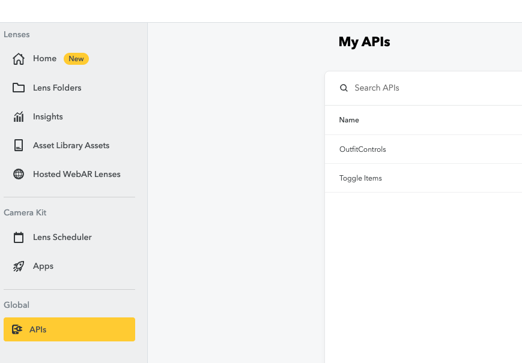
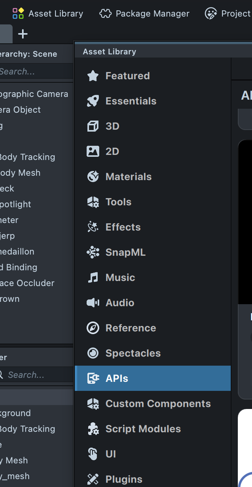
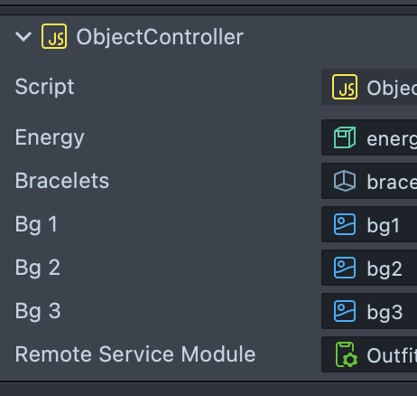

# AntwerpPOV

AntwerpPOV is an interactive campaign concept for the City of Antwerp. The campaign uses stereotypes and POVs to make Gen Z curious about Antwerp as a citytrip destination.

The project consists of two main parts:

1. **Campaign website**
   A website that explains the campaign, shows the stereotypes, links to route pages, displays featured POVs and redirects users to Visit Antwerp.

2. **Interactive installation**
   An AR installation using Snap Camera Kit, Lens Studio lenses, a Vite front-end, a Node.js webrtc server and a remote iPad interface.

---

## Important project links

* **GitHub Project board:** [link](https://github.com/users/matteojacobs/projects/1)
* **Figma design file:** [link](https://www.figma.com/design/WuQ3nN5vbBKCNYUfF5yM7p/INT4---City-of-Antwerp?node-id=1719-852&t=zVDxuZE4YmV3sONW-1)
* **FigJam UX:** [link](https://www.figma.com/board/EzgXlMIdxYPIFoZuatYJjA/Int4-process?node-id=0-1&t=AjEZ9TUIYkobUMwI-1)
* **Microsite website prototype:** [link](https://www.figma.com/proto/LT44wxRA6OS1oafZsf0DJV/Microsite-int4?node-id=1-24748&viewport=121%2C115%2C0.13&t=FuPnlHnyxwmaglzG-1&scaling=min-zoom&content-scaling=fixed&starting-point-node-id=1%3A24748&page-id=1%3A24699)
* **Development process:** [link](https://www.figma.com/board/EzgXlMIdxYPIFoZuatYJjA/Int4-process?node-id=31-1533&t=AjEZ9TUIYkobUMwI-1)

---

# Setup guide — Campaign website

Here are the steps on how to set up and start the campaign site on your own local computer!

The campaignsite is an astro project which means there were some independencies installed, to install them, use 

```bash
npm install
```

since the packages are in the folder.

After that, we make use of supabase to collect and display some images that were taken by our users, through the installations.

This means we have an api and some keys, that are collected in our .env file. This is also crucial for this function to work so this is what u need for our .env in order for it all to work:

```env
API_KEY=APi-key
SUPABASE_URL=supabase-url
SUPABASE_KEY=supabase-service-key

PUBLIC_SUPABASE_URL=supabase-url
PUBLIC_SUPABASE_KEY=supabase-key

STORAGE_URL=storag-url
PUBLIC_STORAGE_URL=public-storage-url
```

To run 
```bash
npm run dev
```

More information on supabase below


---

# Setup guide — Installation

This guide explains how to set up the interactive AntwerpPOV installation from zero.

The installation consists of:

* a **desktop installation page** shown on the main screen
* a **remote page** opened on an iPad or tablet
* a **Node.js server** for WebRTC signaling
* **Snap Camera Kit** for rendering Lens Studio lenses in the browser
* **Lens Studio projects** for the AR lenses
* **Supabase** for storing installation captured images

---

## 1. Folder structure

The installation code is located in the `Installation` folder.

## 2. System requirements

Before starting, make sure you have:

* a stable internet connection
* Node.js installed
* npm installed
* Lens Studio installed
* access to a Snap Developer / My Lenses account. [Setting up lens studio](https://developers.snap.com/lens-studio/publishing/submitting/submitting-your-lens)
* an iPad or tablet for the remote control
* both devices connected to the same network, unless using a hosted URL or tunnel
* (optional) a foot switch to switch between lenses. Pressing the 'n' key is default.

---


## 3. Install the project

Open a terminal inside the `Installation` folder.

```bash
npm install
```

This installs all required dependencies from `package.json`.

---

## 4. Create the environment file

Delete the .example part of .env.example

Then open `.env` and fill it in. 
Scroll down to see **how to set up lens studio and my-lenses.**

Example:

```env
NODE_ENV=development
VITE_SOCKET_URL=http://laptop-ip:443
VITE_CLIENT_URL=http://laptop-ip:5173
VITE_API_KEY= my-lenses API key
VITE_GROUP_ID= my-lenses group ID
VITE_OBJECT_API_SPEC_ID= my-lenses remote API spec ID
VITE_LENS_ID_1= my-lenses lens ID
VITE_LENS_ID_2= my-lenses lens ID
VITE_LENS_ID_3= my-lenses lens ID

SUPABASE_URL=supebase-url
SUPABASE_KEY=supabase-service-key
SUPABASE_BUCKET=bucket-name
CLIENT_URL=http://localhost:5173
```


---

## 5. Start the installation locally

Run in the terminal

```bash
npm run dev
```

This starts the Vite front-end and Node server

---

## 6. Open the desktop installation

On the main installation laptop, open:

```txt
http://localhost:5173
```

This should open the desktop installation page. Important to not use your ip here in this url, then Camera Kit will not work.

---

## 7. Open the remote / kiosk page

The remote page is used on an iPad, tablet or phone.

On the same laptop, it can be opened with:

```txt
http://localhost:5173/remote.html
```

For another device on the same Wi-Fi network, use the laptop IP address:

```txt
http://LAPTOP_IP:5173/remote.html
```

Or simply scan the QR code that is displayed on desktop.

---

# 8. Lens Studio / Camera kit setup

For this installation, you will need Snapchat AR lenses. 
To run the installation with Snap Camera Kit, you need access to a Snap Developer / My Lenses account.

## 8.1 Create or access a Snap Developer account

1. Go to the Snap Developer / [My Lenses portal.](https://my-lenses.snapchat.com/home)
2. Log in with the account used for the project.

tutorials:
- [Snap for developers, set up Camera kit](https://developers.snap.com/camera-kit/getting-started/setting-up-accounts)
- [Publish a lens](https://developers.snap.com/lens-studio/publishing/submitting/submitting-your-lens)

In my-lenses it should look like this:


Under camera kit:
- Lens scheduler: Create a group where your AR lenses will live
- Apps: This is your camera kit app with the necessary api token for the next step
  
## 8.2 Get the Camera Kit API token

In the Camera Kit app settings, copy the API token.

For development and internal testing, use the **staging API token**.

Add it to `.env`:

```env
VITE_API_KEY=your_camera_kit_api_token_here
```

Where you need to be:


## 8.3 Lens group and lens IDs


In My Lenses, find the Lens Group used for the project.

Add the following values to `.env`:

```env
VITE_GROUP_ID=your_lens_group_id_here
VITE_LENS_ID_1=your_first_lens_id_here
VITE_LENS_ID_2=your_second_lens_id_here
```

## 8.4 Camera kit remote API

Before diving into lens studio, you will need a remote API to communicate with the lens and toggle items on and off. 
The Lens uses Camera Kit Remote API to receive states from the browser.


tutorial: [Remote API](https://developers.snap.com/camera-kit/integrate-sdk/web/guides/remote-api)

You need that id to put here in the .env file:
```env
VITE_OBJECT_API_SPEC_ID=api-id
```

## 8.5 Lens studio

Now let's see how to set up the lens to get it working for this project
In Lens Studio you create an AR lens as you wish. There are enough [tutorials](https://developers.snap.com/lens-studio/tutorials/tutorial-overview) out there to follow if you are not familiar with Lens studio yet.

The most important part for this project is importing the API you created on my-lenses portal into Lens Studio and setting up the script. 



If you go to asset library and API than your API should be somewhere in the list. Add it.
In the installation folder of this repo you find:
```txt
src/assets/lens-studio-script.js
```
This script needs to be attached to a scene object. Then you can attach the correct items to it, the items you want to toggle. 



In this image is the script for the raver POV, so one of the things we toggle is the energy drink for example.
If you toggle other items and change the names in the script in lens studio, you need to change it the id's in src/data/povs.ts. The extraAccessories ID must match the name in the lens studio script. 

**Then publish the lens and put in in the lens scheduler group** 

---

# 9. Supabase
The installation saves captured images to a supbase database so it can later be put in the campaign site (if they toggled feature me) and the image can be send to the person. 

## 9.1 Create or access the Supabase project

1. Go to Supabase.
2. Open the AntwerpPOV project or create a new project.
3. Copy the project URL.
4. Copy the service key.
5. Create a storage bucket for the captured images.
6. Add the values to `.env`.

```env
SUPABASE_URL=your_supabase_url
SUPABASE_KEY=your_supabase_service_key
SUPABASE_BUCKET=your_bucket_name
```

Tables: pov-id, decorated_image_path, contact_mode, contact_value, feature_me (bool), created_at, capture_location

---

# 10. Foot pedal setup

The foot pedal is optional. The lens switching also works by pressing the `n` key on the keyboard.

Follow this tutorial for the Arduino / Pro Micro foot pedal setup:

[Foot pedal tutorial](https://www.youtube.com/watch?v=2ID0_RRU4pk)

**Upload the Arduino code**

1. Connect the Arduino / Pro Micro.
2. Open the file:

```txt
src/assets/arduino-pedal.ino
```

3. Upload the code.
