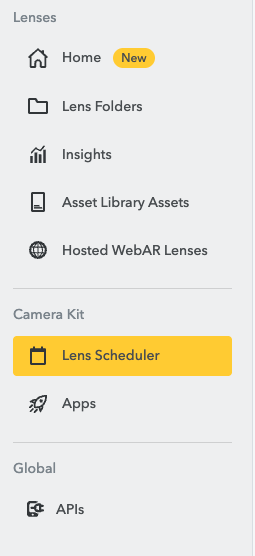
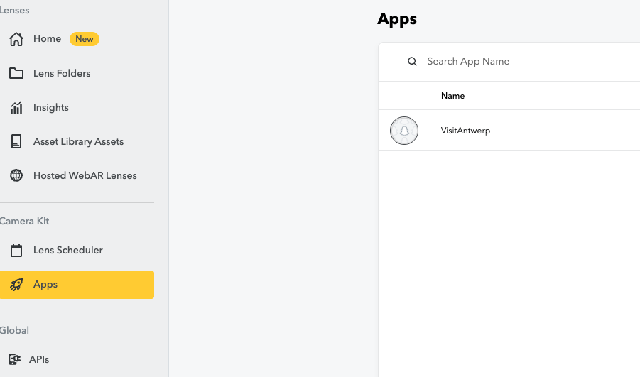
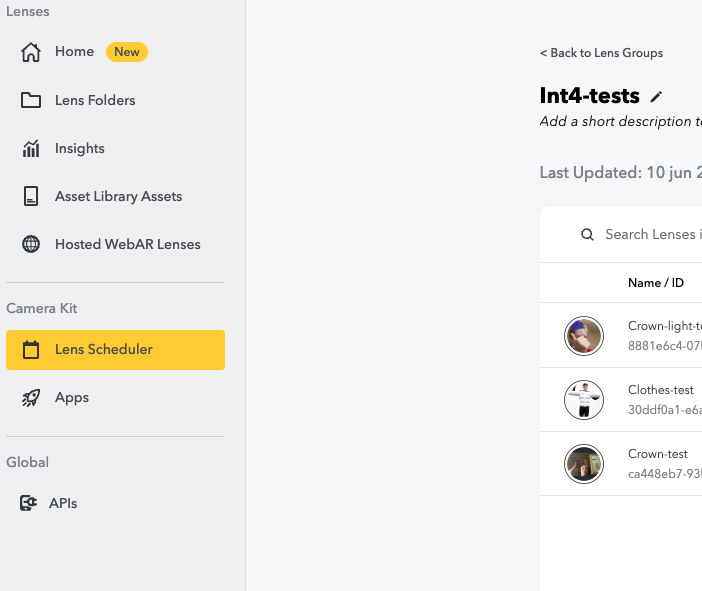

# AntwerpPOV

AntwerpPOV is an interactive campaign concept for the City of Antwerp. The campaign uses stereotypes and POVs to make Gen Z curious about Antwerp as a citytrip destination.

The project consists of two main parts:

1. **Campaign website**
   A website that explains the campaign, shows the stereotypes, links to route pages, displays featured POVs and redirects users to Visit Antwerp.

2. **Interactive installation**
   An AR installation using Snap Camera Kit, Lens Studio lenses, a Vite front-end, a Node.js webrtc server and a remote iPad interface.

---

## Important project links

* **GitHub Project board:** [link](https://github.com/users/matteojacobs/projects/1)
* **Figma design file:** [link](https://www.figma.com/design/WuQ3nN5vbBKCNYUfF5yM7p/INT4---City-of-Antwerp?node-id=1719-852&t=zVDxuZE4YmV3sONW-1)
* **FigJam UX:** [link](https://www.figma.com/board/EzgXlMIdxYPIFoZuatYJjA/Int4-process?node-id=0-1&t=AjEZ9TUIYkobUMwI-1)
* **Microsite website prototype:** [link](https://www.figma.com/proto/LT44wxRA6OS1oafZsf0DJV/Microsite-int4?node-id=1-24748&viewport=121%2C115%2C0.13&t=FuPnlHnyxwmaglzG-1&scaling=min-zoom&content-scaling=fixed&starting-point-node-id=1%3A24748&page-id=1%3A24699)
* **Supabase project:** [add Supabase project link here]
* **Development process:** [link](https://www.figma.com/board/EzgXlMIdxYPIFoZuatYJjA/Int4-process?node-id=31-1533&t=AjEZ9TUIYkobUMwI-1)

---

# Setup guide — Campaign website

text here

---

# Setup guide — Installation

This guide explains how to set up the interactive AntwerpPOV installation from zero.

The installation consists of:

* a **desktop installation page** shown on the main screen
* a **remote page** opened on an iPad or tablet
* a **Node.js server** for WebRTC signaling
* **Snap Camera Kit** for rendering Lens Studio lenses in the browser
* **Lens Studio projects** for the AR lenses
* **Supabase** for storing installation captured images

---

## 1. Folder structure

The installation code is located in the `Installation` folder.

## 2. System requirements

Before starting, make sure you have:

* a stable internet connection
* Node.js installed
* npm installed
* Lens Studio installed
* access to a Snap Developer / My Lenses account. [Setting up lens studio](https://developers.snap.com/lens-studio/publishing/submitting/submitting-your-lens)
* an iPad or tablet for the remote control
* both devices connected to the same network, unless using a hosted URL or tunnel

---

## 3. Install the project

Open a terminal inside the `Installation` folder.

```bash
npm install
```

This installs all required dependencies from `package.json`.

---

## 4. Create the environment file

Delete the .example part of .env.example

Then open `.env` and fill it in. 
Scroll down to see **how to set up lens studio and my-lenses.**

Example:

```env
NODE_ENV=development
VITE_SOCKET_URL=http://laptop-ip:443
VITE_CLIENT_URL=http://laptop-ip:5173
VITE_API_KEY= my-lenses API key
VITE_GROUP_ID= my-lenses group ID
VITE_OBJECT_API_SPEC_ID= my-lenses remote API spec ID
VITE_LENS_ID_1= my-lenses lens ID
VITE_LENS_ID_2= my-lenses lens ID
VITE_LENS_ID_3= my-lenses lens ID

SUPABASE_URL=supebase-url
SUPABASE_KEY=supabase-service-key
SUPABASE_BUCKET=bucket-name
CLIENT_URL=http://localhost:5173
```


---

## 5. Start the installation locally

Run in the terminal

```bash
npm run dev
```

This starts the Vite front-end and Node server

---

## 6. Open the desktop installation

On the main installation laptop, open:

```txt
http://localhost:5173
```

This should open the desktop installation page. Important to not use your ip here in this url, then Camera Kit will not work.

---

## 7. Open the remote / kiosk page

The remote page is used on an iPad, tablet or phone.

On the same laptop, it can be opened with:

```txt
http://localhost:5173/remote.html
```

For another device on the same Wi-Fi network, use the laptop IP address:

```txt
http://LAPTOP_IP:5173/remote.html
```

Or simply scan the QR code that is displayed on desktop.

---

# 8. Snap Camera Kit setup

To run the installation with Snap Camera Kit, you need access to a Snap Developer / My Lenses account.

## 8.1 Create or access a Snap Developer account

1. Go to the Snap Developer / [My Lenses portal.](https://my-lenses.snapchat.com/home)
2. Log in with the account used for the project.

- [Snap for developers, set up Camera kit](https://developers.snap.com/camera-kit/getting-started/setting-up-accounts)
- [Publish a lens](https://developers.snap.com/lens-studio/publishing/submitting/submitting-your-lens)

In my-lenses it should look like this:



In the lens scheduler:
- create a group where your AR lenses will live
Apps:
- This is your camera kit app with the necessary api token for the next step
  
## 8.2 Get the Camera Kit API token

In the Camera Kit app settings, copy the API token.

For development and internal testing, use the **staging API token**.

Add it to `.env`:

```env
VITE_API_KEY=your_camera_kit_api_token_here
```

Where you need to be:



## 9.4 Lens group and lens IDs



In My Lenses, find the Lens Group used for the project.

Add the following values to `.env`:

```env
VITE_GROUP_ID=your_lens_group_id_here
VITE_LENS_ID_1=your_first_lens_id_here
VITE_LENS_ID_2=your_second_lens_id_here
```

---

# 10. Lens Studio setup


